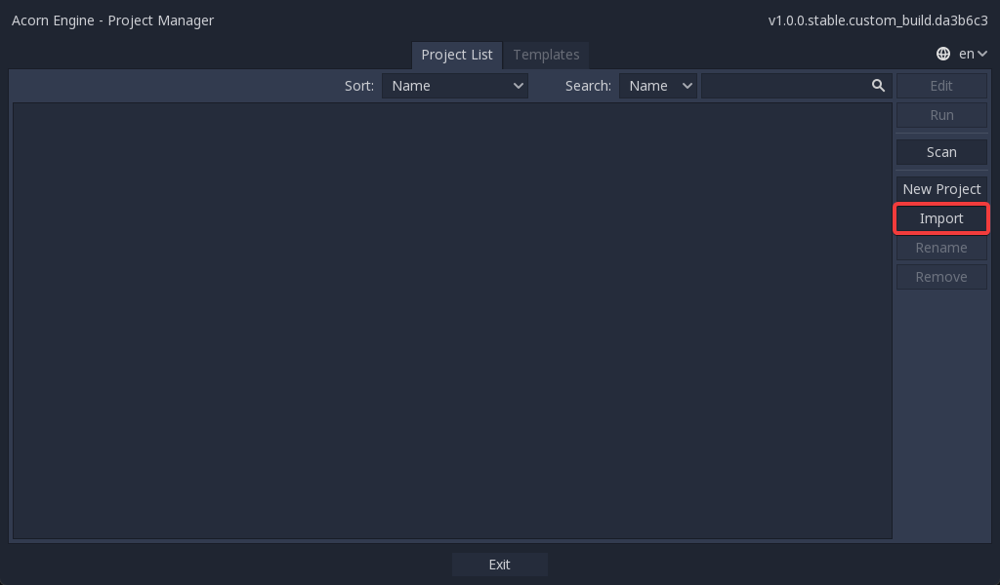
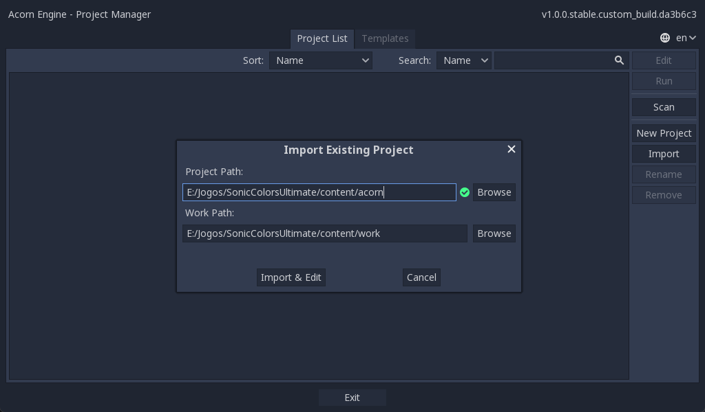

# Acorn Engine
Modified Godot to have better support for Sonic Colours: Ultimate.

# Current features
- Version number was changed to 1 due to being Blind Squirrel Engine v1 and not Godot v3
- cast_shadow's default was changed from On to Off
- cast_character_shadow has been added
- Support for importing projects from PCKs, while saving edited files in a specified "work" folder. Said folder also takes priority over files in PCKs.

# How to Import a specific Blind Squirrel PCK Project
- Download [SCU_GDScript.7z](https://github.com/hedge-dev/godot-bse/releases/download/acorn-1.1.1/SCU_GDScript.7z) and extract it to a folder in your computer. This will be your "work" folder.
- Download the latest release from "Releases" and run the executable **using the provided batch file!**
- In the Project Manager, select Import.

- Select `sonic0.pck` as the project path, and use the folder you previously created as the work folder. The work folder will be where you will place your modified files, alongside the decompiled scripts you downloaded.

- Finally, press "Import and Edit" to finish the process!

NOTE: Godot may crash once it finishes loading all the files. This is normal. Just re-open the project and it should work without issues